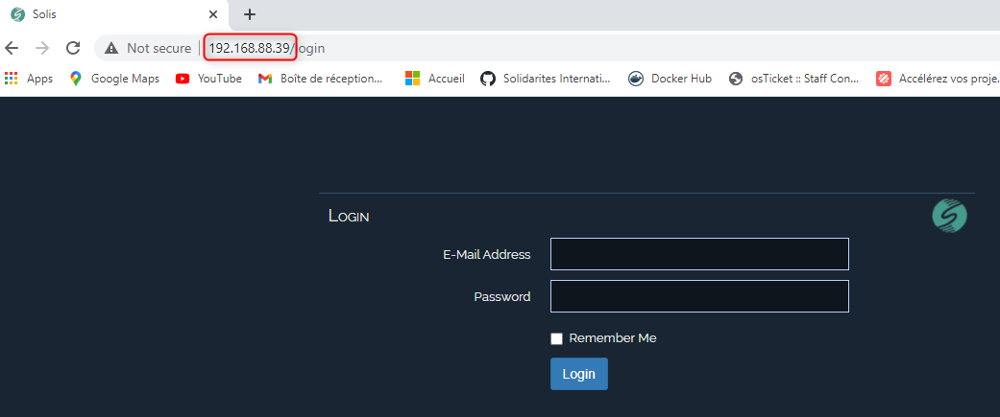
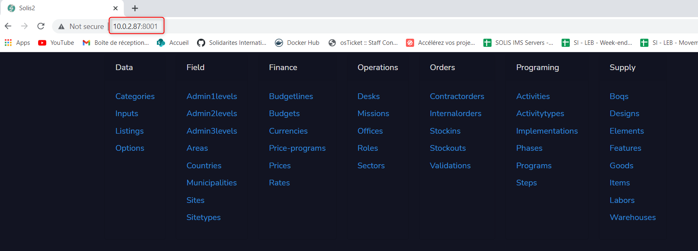
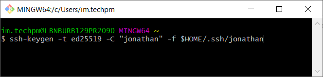
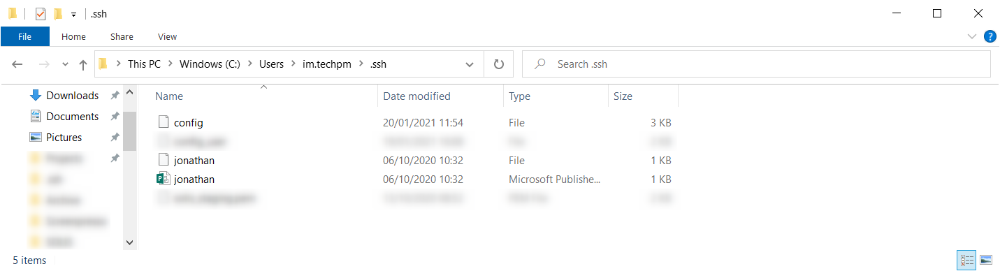
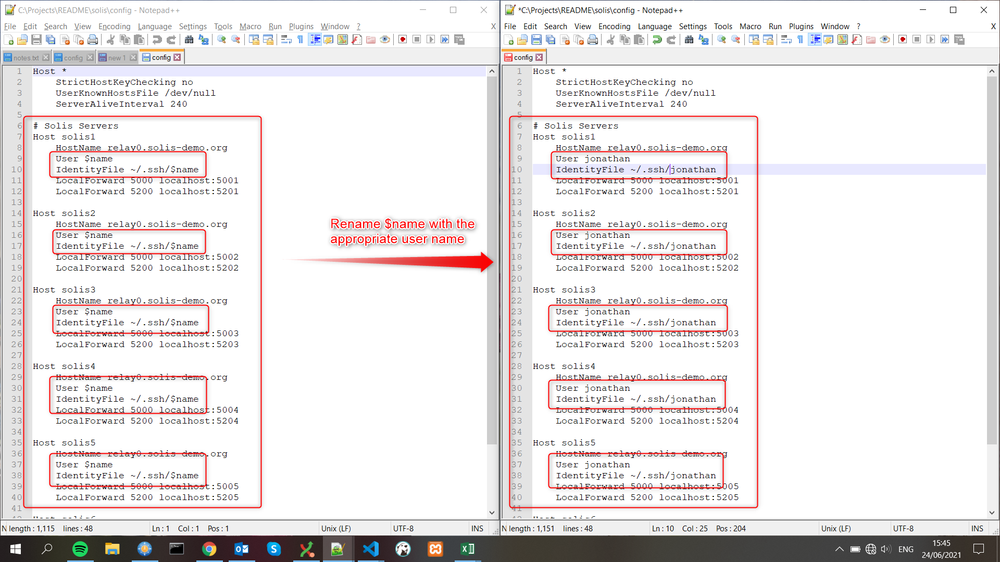
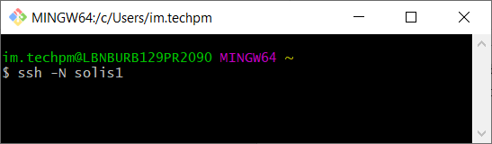
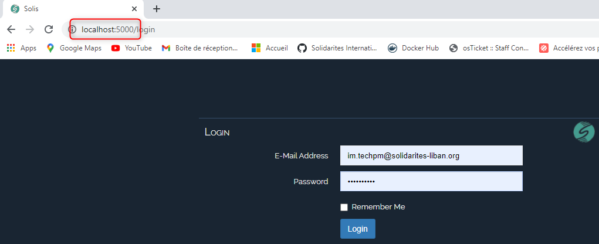
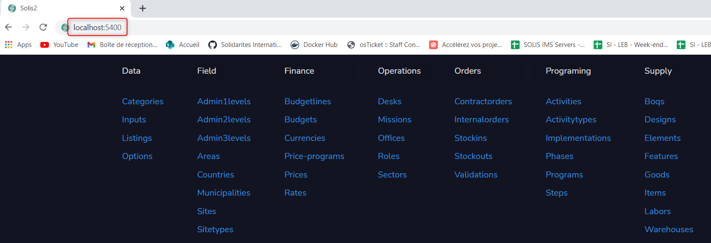

# SOLIS

## Introduction

This document explains how to use the SOLIS application when working at the office or remotely.
When working at the office, to have the most efficient connection, you can access the SOLIS application through the server's **local IP address**, but when working remotely, you will need to connect to the server through a **ssh connection** a **relay server**.

Currently, we have 6 SOLIS servers on the mission:

| Server name | Location | Local IP address |
| ----------- | -------- | ---------------- |
| solis1      | Miniyeh  | 192.168.88.39    |
| solis2      | Beirut   | 192.168.88.192   |
| solis3      | Beirut   | 192.168.88.193   |
| solis4      | Zahle    | 10.0.2.78        |
| solis5      | Miniyeh  | 192.168.88.40    |
| solis6      | Zahle    | 10.0.2.87        |

## At the office

When working at the office, and connected to the office Wifi, you can access the SOLIS application directly by typing in the **local IP address** of the server in any web browser, followed by **:8000**.
For example, if you are at the Zahle office, you can connect to **solis6** by opening any web browser and entering the URL **10.0.2.87:8000**.

And you will get redirected to the SOLIS login page.

You can also access a demo version of the Solis 2 application by replacing the port **:8000** by **:8001**.

## Remotely

In order to access the SOLIS application remotely, for security reasons, you need to gain access rights to the servers, and you will need to set a few things up on your computer before.

### Initial setup (to be done only once)

To access the server remotely, you will need to connect to a relay server through a **ssh connection**, and for that, you will first need to generate a **ssh private / public key pair**.
Please follow the below steps:

1. Download and install Git Bash for Windows from the following link : <https://gitforwindows.org/>
2. Open Git Bash, and run the following command in the terminal to generate your **ssh private / public key pair** (replace the `name` by your first name, last name or windows login):

   `ssh-keygen -t ed25519 -C "name" -f $HOME/.ssh/name`

   You can provide a passphrase for your ssh key file, or leave it empty.

   

This will create 2 files in the folder `C:\Users\user_name\.ssh\` (`user_name` is your windows login):

- _name_ : this is your **ssh private key**
- _name.pub_ : this is your **ssh public key**
  (_name_ is the name you provided in the previous step)

Once you have succesfully generated these files, please contact the IM team and send them your **ssh public key** and the _name_ you chose, and we will provide remote access to the servers for you.

You will also need an **ssh configuration file** to simplify the connection process. Please follow the below steps to do this:

- Download the provided **ssh configuration file**: [config](config)
- Copy it to the _.ssh_ folder in your user directory (`C:\Users\user_name\.ssh\`) and keep the name as _config_.
- Open the file and rename all of the **$name** fields with the user name you have used previously.

### Connect to the server

When working from home, you will access the SOLIS application through a **ssh connection**. Please follow the below steps everytime you want to access the application:

1. Open Git Bash and run one of the following commands in the terminal, depending on which server you want to connect to

   `ssh -N solis1`

   `ssh -N solis2`

   `ssh -N solis3`

   `ssh -N solis4`

   `ssh -N solis5`

   `ssh -N solis6`

   If you have provided a passphrase for your **ssh private key** in the initial setup, you will need to provide this passphrase.

   

2. Open any web browser and access the SOLIS application with the following URL:

   `localhost:5000`

   And you will get redirected to the SOLIS login page.

   

3. You can also access a demo version of the Solis 2 application with the following URL:

   `localhost:5200`

   

## Troubleshooting

In case you have connection issue with any server, please contact a member of the IM team. We will gladly help you out !

## ssh configuration file for system administrators

For system administrators:

- Download the provided **ssh configuration file for administrators**: [config_admin](config_admin)
- Copy it to the _.ssh_ folder in your user directory (`C:\Users\user_name\.ssh\`) and rename it as _config_.
- Open the file and rename all of the **$name** fields with the user name you have used previously.

This file will allow you to connect to all of the servers and relays directly, as well as all of our cloud servers, if you have the proper ssh private key.
